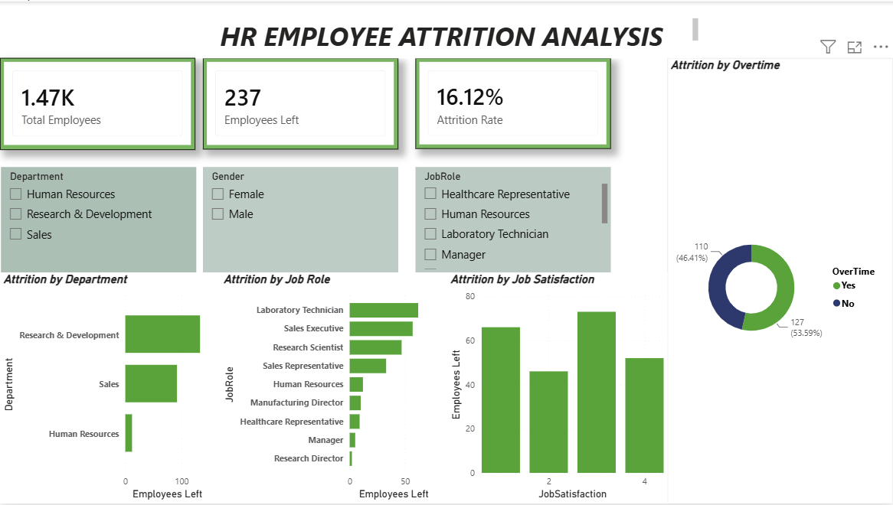

## HR Employee Attrition Analytics

##  Project Overview

This project analyzes employee attrition patterns to understand the key factors associated with employee turnover.

The analysis explores employee demographics, job roles, compensation, job satisfaction, work experience, and other factors that may influence attrition.

## Tools Used

- Python
- Pandas
- SQL
- Power BI

##  Key Analysis Areas

- Employee attrition analysis
- Attrition by department and job role
- Attrition by age and gender
- Monthly income analysis
- Job satisfaction analysis
- Work experience analysis
- Overtime and attrition analysis

##  Project Workflow

1. Data cleaning and exploration using Python
2. Exploratory data analysis using Pandas
3. Business analysis using SQL
4. Interactive dashboard creation using Power BI
5. Deriving business insights and recommendations

##  Files Included

- Python analysis notebook
- SQL analysis queries
- Power BI dashboard

##  Objective

To identify employee groups and workplace factors associated with higher attrition and provide data-driven insights that can support employee retention strategies.

##  Dashboard Preview

